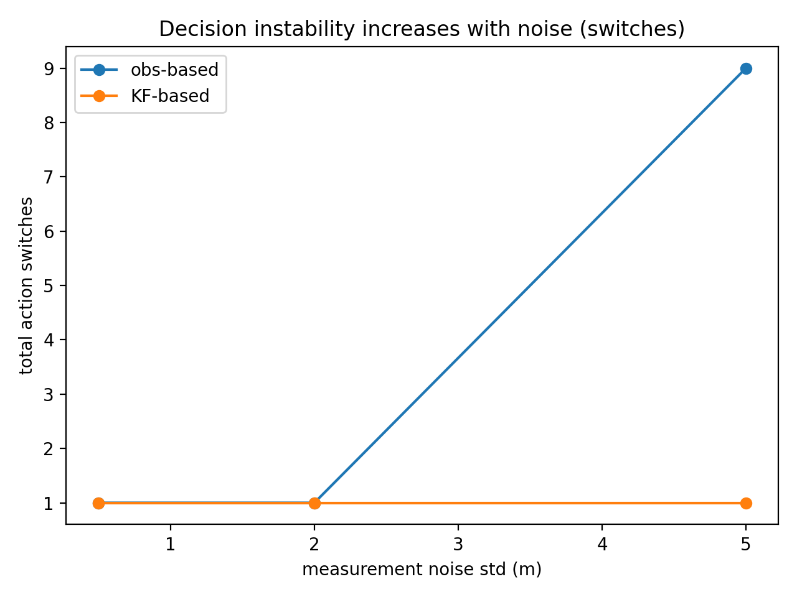
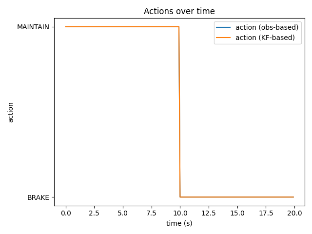
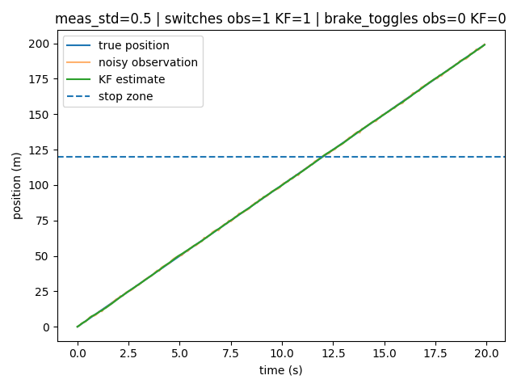
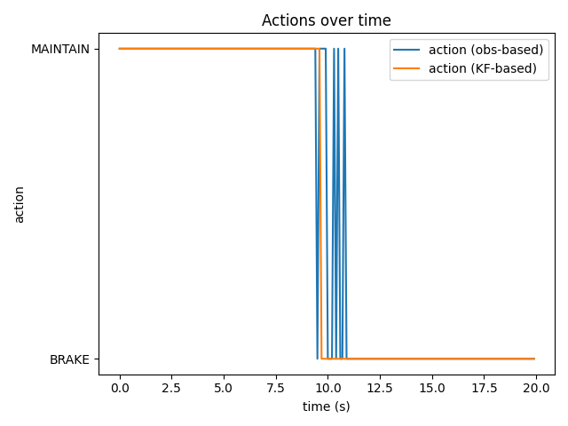

# MDP + Kalman Filtering: How Open-Loop Perception Uncertainty Impacts Decisions

This project demonstrates how open-loop perception noise can destabilize downstream decision-making in autonomy, and how belief-state estimation using Kalman filtering restores temporal consistency. Using a minimal 1D vehicle motion model, we compare decisions made from raw observations versus filtered belief states, and quantify decision instability under increasing sensor noise.

## Motivation
Autonomous driving operates under partial observability:
- Sensors provide noisy, incomplete measurements of the world
- Decisions are often made near safety-critical thresholds (e.g., braking distance)
A common failure mode is not gross inaccuracy, but decision instability:
> small measurement noise causes repeated switching between actions (e.g., brake / no-brake).
This project shows that belief-state estimation (rather than raw perception) is essential for stable and safe decision-making.

## What this repo contains
- A simple 1D vehicle motion model (state = position, velocity)
- Noisy position observations (simulating perception noise)
- A constant-velocity Kalman Filter to maintain a belief state
- A simplified MDP-style decision rule with discrete actions (BRAKE / MAINTAIN)
- Experiments showing how increasing observation noise affects decisions

## Key idea
Using a belief estimate (mean + uncertainty) produces earlier and more stable decisions compared to using raw noisy observations.

## How to run
```bash
pip install -r requirements.txt
python src/experiments.py
```
## System Overview
- State: xt​=[positiont ​velocityt​​]
- Dynamics (constant velocity): xt​=Fxt−1​+wt​
- Observation (noisy position): zt​=Hxt​+vt​
- Belief update: Kalman Filter
- Decision policy: MDP-style rule
                   𝜋(𝑏𝑡)→{MAINTAIN,BRAKE}

Two policies are compared:
Observation-based (open-loop): decisions from raw measurements
Belief-based: decisions from Kalman-filtered state estimates

## Why Kalman Filtering Stabilizes Decisions (Intuition)

At each timestep, the Kalman filter performs:

Prediction       𝑥^𝑡−=𝐹𝑥^𝑡−1

> Enforces physical continuity (vehicles don’t teleport)

Update      𝑥^𝑡=𝑥^𝑡−+𝐾𝑡(𝑧𝑡−𝐻𝑥^𝑡−)

where the Kalman Gain:  𝐾𝑡 ∝ prediction uncertainty / prediction uncertainty+measurement noise
	​​
>High measurement noise → trust the model more than the sensor

## Key Effect

- Noisy measurements cannot abruptly flip the belief
- Belief evolves smoothly in time
- Decision thresholds are crossed once, not repeatedly

This directly explains why belief-based policies avoid action chattering.

## Experimental Results

Below are 9 figures (3×3) showing state estimation and decision behavior under increasing measurement noise.

### Low Measurement Noise (σ = 0.5 m)

| Position Estimation | Action Decisions | Decision Instability Metric |
|--------------------|------------------|-----------------------------|
|  |  |  |
| *KF tracks true state closely.* | *Both policies switch cleanly once.* | *Low instability at low noise.* |

### Medium Measurement Noise (σ = 2.0 m)

| Position Estimation | Action Decisions | Local Boundary Instability |
|--------------------|------------------|----------------------------|
|  |  |  |
| *Observations begin to jitter; KF remains smooth.* | *Obs-based policy starts oscillating near threshold.* | *Instability increases near braking boundary.* |

### High Measurement Noise (σ = 5.0 m)

| Position Estimation | Action Decisions | Post-Brake Stability |
|--------------------|------------------|----------------------|
|  |  |  |
| *Severe noise; KF belief remains stable.* | *Obs-based policy chatters; KF stable.* | *Only obs-based policy reverses braking.* |

### Interpretation

As measurement noise increases, decisions based directly on raw observations become unstable and oscillatory near safety-critical thresholds.  
Kalman filtering stabilizes decision-making by enforcing physical dynamics and uncertainty-aware belief updates, preventing noisy measurements from repeatedly crossing decision boundaries.

## Key Takeaway

**Decision stability depends more on belief consistency than raw perception accuracy.**  
Under partial observability, belief-state estimation prevents action chattering and stabilizes downstream decision-making.


